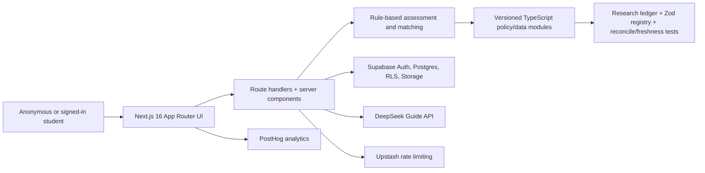

# LandingPad — Comprehensive Product & Codebase Audit

**Date:** 2026-07-10 · **Method:** repository, documentation, Kanban, migrations/schema, APIs, user-flow, test/build, browser, and current-source review, followed by adversarial cross-checking against the implementation.
**Full section files (appendices):** [`sections/`](sections/) — product-walkthrough · feature-gaps · journey-audit · ux-audit · technical-audit · database-strategy · content-pipeline · trust-credibility · roadmap-audit · mvp-definition · scalability-plan · competitive-analysis · monetization.
**Naming note:** the founder's brief titles the product "LandingPad"; production ships three identities (footer "MyVisa", email @merovisa.app, repo MeroVisa). Treated here as LandingPad, flagged as a launch blocker (§Register, F-4).

**Evidence boundary:** this audit verifies the checked-out code and local Kanban. It does not claim access to production analytics, production database contents, support logs, contracts, processor DPAs, legal advice, or direct student interviews. Claims that require those inputs are explicitly recommendations or founder gates, not presented as facts.

---

## 1. Executive summary — are we building the right product, in the right order?

**The right product: yes, if it is framed as a readiness and coordination system first.** The assess → explanation → shortlist → plan → checklist spine solves a real problem: turning scattered official/provider information into a Nepal-specific sequence. The source/version discipline can become a moat. **But “real chances” and “replaces the consultancy” over-claim today.** The verdict is hand-calibrated and not outcome-validated; the product does not execute applications, verify evidence, manage offer conditions, lodge visas, or support settlement. The credible current promise is: *“know what is official, where you appear ready, what is uncertain, and what to do next before anyone profits from your decision.”* Replacing more consultancy work then becomes a staged north star: application operations, a Genuine Student evidence workspace, regulated escalation, and eventually verified outcomes.

**The right order: no.** The board funds mascot/imagery polish while core outputs can be wrong, sensitive anonymous data is never purged, outcome data can be forged for future calibration, Google is the only save path, and no accurate privacy/terms notice exists. After those foundations, the cheapest journey-depth move is wiring already-maintained pre-departure/arrival data; the most on-brand product move is a sourced off-ramp for Reach/unsupported students. New countries, a community, and decorative brand systems should wait.

**The most damaging cluster is live decision incorrectness, not missing breadth.** Browser verification selected **Law** and received “60 matched your profile,” led by Accounting/MBA programs marked Strong/Possible. The same result declared an all-in budget covered tuition without reserving living costs and printed “6 months bank seasoning expected,” despite the repo's own research saying no fixed DHA duration is published. Separately, the wizard omits prior refusals even though signed-in scoring penalizes them. These are launch blockers because they invalidate the product's core claim at the exact moment a student is deciding whether to trust it.

**Launch readiness:** the corridor is broad enough for a controlled beta, but launch is blocked by **truth/correctness defects, legal disclosure and consent, identity (name), the auth wall, and operational blindness (no error monitoring)** — not by adding more decorative breadth.

---

## 2. What is verifiably strong (don't break these)

- **Provenance machinery**: most registered decision data carries `findingRefs`/source/freshness metadata; reconcile and parity tests catch many code↔ledger↔migration drifts. Coverage gaps remain, but the foundation is valuable.
- **Honest verdict discipline**: banded verdicts, score never rendered; `scoringRulesStale` runtime degrade wired to the verdict card; Estimated/Verified labels; a guide that refuses to ghostwrite.
- **Security fundamentals**: RLS is forced on exposed tables, FKs are indexed, and most service-role writes are owner-fenced. RLS protects cross-user access, but it does not validate the semantic truth of owner-inserted outcome rows (O-1).
- **A11y/UX primitives**: per-group error boundaries, reduced-motion, focus-visible, roving tabindex, persist-miss retry. ~297 test files / 1,900+ tests.
- **MV-08 outcome capture is more alive than anyone thought** (§4).

### Current architecture, in one view

This is a sensible v1 split: version-controlled policy knowledge and deterministic scoring in code; user-owned state and private files in Supabase. The immediate scaling constraint is not a microservice boundary. It is correctness, duplicated request-time reads, an owner-global data model with no journey/case entity, and the absence of an operational publishing/review workflow.

### Verified implementation inventory

| Area | What is built |
|---|---|
| Public/marketing | `/`, `/destinations`, `/destinations/[id]`, `/how`, `/trust`, `/auth` |
| Anonymous/focused | `/assess`, `/assessment/[id]`, OAuth callback, result claim/recovery |
| Signed-in | `/dashboard`, `/profile`, `/matches`, `/plan`, `/documents`, `/checklist`, `/checklist/all`, `/checklist/[programId]`, `/guide` |
| Main APIs | assessment create/refresh; result claim-signing; profile section save; plan action; shortlist/applied; document upload/view/status/delete; Guide chat; outcome prediction/attempt/event/read; lead capture; account deletion; auth/dev-sign-in helpers |
| Persistence | `assessments`, `profiles`, `leads`, `universities`, `programs`, `user_program_state`, `plan_items`, `documents`, `document_status`, `program_predictions`, `application_attempts`, `outcome_events` + private Storage |
| Catalogue/data | 15 universities, 83 programs across six catalogue fields; extensive Nepal/Australia policy/source modules and a large research ledger; Australia is the only enabled scoring destination |
| Tests/CI | 297 Vitest files / 1,911 passing tests; typecheck/lint/build gates; Supabase integration job exists but is advisory; no browser E2E suite |
| Kanban at audit time | 123 cards: 110 Done, 8 Backlog, 3 Blocked, 2 In Review, 0 Ready/In Progress. The active queue is empty while launch blockers are uncaptured or blocked. |

The README remains mostly framework boilerplate, while `CLAUDE.md`, `docs/PROJECT_STATUS.md`, specs/plans, research ledger, migrations, and Kanban carry the real product knowledge. `PROJECT_STATUS.md` is a historical snapshot and still cites the older 64-program catalogue; the Kanban and current seed/migrations are more authoritative.

---

## 3. Verified P0/P1 register (deduped across sections)

### Trust integrity
| # | Sev | Finding | Evidence | Fix effort |
|---|-----|---------|----------|-----------|
| F-1 | **P0** | **Anonymous wizard omits prior-refusal question; scorer penalizes it** → dishonestly optimistic anonymous verdict, silent band-drop after sign-in. Fact-checked CONFIRMED. | `components/wizard/wizard.tsx:23-33` (no refusal step); `lib/scoring/visa.ts` (REFUSAL_VISA_PENALTY −15/−35); `lib/scoring/from-sections.ts:60` → `lib/assessments/re-score.ts` | **S** — add one wizard step (or badge the anonymous verdict "assumes no prior refusals" until asked) |
| F-2 | **P0** | **No `/privacy` or `/terms` in production** while storing grades, funding, age, dependents + a documents vault that holds passports/bank statements. No consent/guardian gate; age is a free-text 15–80 integer, not DOB. MV-05 engineering is merged; blocked only on four founder-suppliable facts. | routes absent; `components/layout/footer.tsx:6-22` (no legal links); MV-05 dossier D1/D3 | **S** (founder supplies facts; publish) |
| F-3 | P1 | **English scoring bug**: `profile-strength.ts` compares raw PTE/TOEFL scores against IELTS bands (≥7.5/≥7.0), so any non-IELTS taker gets the max bonus and UI renders "Strong English (58.0)". `visa.ts` normalizes correctly via `toIeltsEquivalent`; profile-strength doesn't. **Re-verified by orchestrator.** | `lib/scoring/profile-strength.ts:15-17,48-52` | **S** |
| F-4 | P1 | **Three product identities ship simultaneously** ("MyVisa" footer, @merovisa.app, "LandingPad" brief). Blocks legal entity naming, domain, privacy policy, marketing. | footer, /trust contact | Founder decision + **S** |
| F-5 | P1 | **Verdict core is unsourced hand-tuning** (dimension weights .30/.25/.25/.20, band cutoffs, FX rates, field competitiveness — all `internal-heuristic`, empty findingRefs) while `/how` implies the verdict comes from Home Affairs. Honest disclosure gap, not a calibration demand. | `lib/data/policy/*`, `lib/data/scoring-config.ts` | **S** (disclose "our calibration, our judgment" on /how + results) |

### Promise/behaviour and decision-correctness defects
| # | Sev | Finding | Evidence | Fix effort |
|---|-----|---------|----------|-----------|
| C-1 | **P0** | **The privacy story is materially false today.** `/trust` says assessment data is used for verdicts/matches and “nothing more,” documents replace values with verified ones, and nothing is shared with third parties. In reality uploads are not read, and Guide sends derived assessment, match, plan, cost, chat-history, and message context to DeepSeek. PostHog is another configured processor. | `app/(marketing)/trust/page.tsx:39-46`; `app/(marketing)/how/page.tsx:74-81`; `app/api/guide/chat/route.ts:50-69`; `lib/analytics/*` | **S–M** copy + legal review; disable Guide until disclosure/consent if necessary |
| C-2 | **P0** | **Deletion and retention promises contradict both each other and code.** `/trust` says “real deletion” and also 12-month assessment retention; the deletion route explicitly deletes assessment rows before deleting the auth identity. | `app/(marketing)/trust/page.tsx:71-77`; `app/api/account/delete/route.ts:18-24,65-74` | **S** after policy decision |
| C-3 | **P0** | **The match budget calculation answers the wrong question.** The wizard asks for annual tuition **plus living costs**, then `computeMatches` compares the entire amount only with tuition and can say “budget covers tuition.” | `components/wizard/steps/budget-step.tsx:80-84`; `lib/matches/compute.ts:73-86,139-149` | **M**; split tuition, living, dependants, and total first-year funds |
| C-4 | **P0** | **Incomplete profiles become fabricated zeroes.** A profile containing only a name passes the `/matches` empty-object gate; missing grade, English, and budget default to `0`, producing confident Reach gaps instead of “unknown.” | `app/(app)/matches/page.tsx:43-57`; `lib/matches/compute.ts:73-76` | **S–M** |
| C-5 | **P0** | **The product ships an unsupported “6 months bank seasoning expected (Nepal AL3)” claim.** The project’s own research concludes DHA publishes no fixed seasoning duration and practitioner claims conflict; the live matcher, plan, and checklist nevertheless present six months as expected/recommended. | `lib/matches/compute.ts:153-157`; `lib/plan/generator.ts:196-203`; `lib/checklist/generator.ts:244`; `docs/research/2026-06-12-nepal-ssvf-financial-scrutiny.md:12-19` | **S** copy/rule removal or clearly-labelled product recommendation with evidence basis |
| C-6 | P1 | **The “profile accuracy” meter cannot reach its own Verified or Complete states.** It starts at 25 and adds only 3, while thresholds are 40/75; uploads listed as suggestions never affect the score. | `lib/results/accuracy.ts:15-29` | **S**; redesign as completeness, not confidence |
| C-7 | P1 | **PTE/TOEFL profile entry is internally inconsistent.** Overall fields use test-specific maxima, but listening/reading/writing/speaking remain capped at IELTS 9 with 0.5 steps. | `components/profile/editors/english-editor.tsx:24-29,69-85` | **S** |
| C-8 | P1 | **Document replacement is destructive before validation.** The existing object and row are removed before magic-byte verification and new upload; an invalid replacement or storage failure destroys the good prior document. | `app/api/documents/upload/route.ts:65-91` | **S–M**; upload/validate first, transactionally switch metadata, then delete old bytes |
| C-9 | P1 | **OAuth claim failures are swallowed.** Callback errors redirect to `/assess?error=…`, but `/assess` reads only `new`; a high-intent user receives no recovery explanation. | `app/auth/callback/route.ts:36-60`; `app/(focused)/assess/page.tsx:6-14` | **S** |
| C-10 | **P0** | **The wizard offers fields the catalogue cannot match, then labels unrelated programs as matches.** In browser verification, selecting Law produced “60 matched your profile,” led by Accounting and MBA programs marked Strong/Possible. Field is only a sort tier; the unmatched remainder is never suppressed. | `components/wizard/steps/field-step.tsx`; `lib/matches/compute.ts:29-48`; browser-verified 2026-07-10 | **S–M**; disclose coverage before selection and render no relevant matches/pathway alternatives, not unrelated “matches” |
| C-11 | P1 | **Unsupported destinations are marketed as “Six countries, done well.”** Canada/UK/Germany/USA/Ireland pages publish changing costs/policy snippets but cannot produce an assessment. This expands freshness liability and promise scope without journey value. | `app/(marketing)/destinations/page.tsx:9-14`; `lib/marketing/destinations.ts`; `SUPPORTED_DESTINATIONS` | **S**; reposition as research previews or remove until supported |
| C-12 | P1 | **Guide grounding is a prompt promise, not an enforced citation contract.** DeepSeek returns unstructured text; there is no citation/source-ID schema, URL allow-list, post-generation verifier, feedback/eval set, persistence, or cost audit. Landing says answers have the source attached and the guide remembers the user, while chats disappear on refresh. | `lib/guide/deepseek.ts`; `lib/guide/system-prompt.ts`; `components/guide/guide-chat.tsx`; landing copy | **M–L**; structured source IDs, validation/refusal, evals, disclosure, persistence/feedback before premium AI |

### Funnel & conversion
| # | Sev | Finding | Evidence | Fix effort |
|---|-----|---------|----------|-----------|
| F-6 | **P0** | **Google-only sign-in** ("Email sign-in isn't ready yet"). Saving, converting, every `(app)` route, and the only anonymous-recovery path all require Google. Not carded on the board. | `components/auth/auth-card.tsx:38-63` | **M** (Supabase magic-link email auth) |
| F-7 | P1 | **3-day expiry is a silent data-loss trap**: no email capability exists anywhere in the codebase (grep resend/sendgrid/nodemailer/postmark = 0), so the core conversion lever fires with no reminder, no deliver-a-copy, no recovery. Also a values tension: an anti-dark-pattern product deleting a student's assessment to manufacture urgency. | `conversion-paths.tsx:51,57`; `lib/assessments/expiry.ts` | **M** (email touch) + policy decision on expiry length |
| F-8 | P1 | **No re-engagement loop at all** (no email/push/reminder); dashboard is a static mirror of user-entered state. Critic caveat: for this demographic the channel may be **Viber/WhatsApp/Messenger**, not email — don't assume email closes this alone; a share/save-to-WhatsApp affordance may outperform. | repo-wide | M (email) + **S** (WhatsApp share) |
| F-9 | P1 | **No human fallback on any dead-end** (unsupported destination, guide 503, no-Google, expired assessment) except a mailto buried in /trust; no /about, no named human accountable anywhere. | `app/(app)/guide/page.tsx`, `destination-notice.tsx` | **S** |

### Journey depth (the consultancy-replacement gap)
| # | Sev | Finding | Evidence | Fix effort |
|---|-----|---------|----------|-----------|
| F-10 | P1 | **Journey hard-stops at "track-visa-decision"**: application = one generic step, waiting period = one line (no processing-time expectations, no RFI coaching), and all 9 post-grant stages (pre-departure → arrival → work → accommodation → community → PR) are **Absent**. See journey table in [`sections/journey-audit.md`](sections/journey-audit.md). | `lib/plan/generator.ts:322-329,388-396` | L (staged) |
| F-11 | P1 | **Five sourced data modules render to ZERO surfaces**: `au-arrival-cash-guidance`, `nepal-forex-cards`, `au-student-worker-wages`, `au-student-transport-concessions`, `au-skilled-visa-directory`. Maintenance paid, zero student value. Cheapest journey-depth win available. | 0 imports outside lib/data + tests | **S–M** |
| F-12 | P1 | **No Genuine Student preparation workspace** — a high-stakes part of the visa case gets one guidance block ("draft yours early"); the guide is correctly hard-ruled against ghostwriting. A guided *workspace* (evidence mapper, question-by-question structure, consistency checks, source-backed self-review rubric) is a major consultancy-replacement capability without writing the application for the student. | `lib/plan/generator.ts` (prepare-gs-answers); `lib/guide/system-prompt.ts` | **L** |
| F-13 | P1 | **No off-ramp for "Reach" students** — bare band label, no improve-path (retake IELTS, pathway/diploma providers, regional universities, defer intake), then a 3-day delete. The crown-jewel differentiator (honest verdict) is a trust failure for the highest-need user. | `verdict-labels.ts` | **M** |
| F-14 | P2 | Application tracking is a 3-value dropdown (`shortlisted|applied|withdrawn`) — no deadlines, offer/CoE states, per-app documents, or consolidated calendar. | `user_program_state` | M–L |

### Operations & technical
| # | Sev | Finding | Evidence | Fix effort |
|---|-----|---------|----------|-----------|
| O-1 | **P0** | **Outcome/calibration data is forgeable through Supabase's exposed Data API.** Authenticated RLS proves ownership, but users can insert their own prediction, attempt, and outcome rows without the API's server-derived verdict, state-machine, program-consistency, or authority checks. The loop must not be used for calibration or B2B analytics in this state. | `supabase/migrations/20260620000000_add_outcome_validation.sql:137-193`; API validation is only in route code | **M**; revoke direct inserts and use one transactional RPC/server boundary with DB constraints/triggers |
| O-2 | **P0** | **Three-day expiry is access expiry, not deletion.** Anonymous assessment rows contain profile/result JSON and `expires_at`, but no cron/purge/delete path exists; an anonymous user has no account-deletion control. | initial assessments migration; `lib/assessments/repo.ts`; repo-wide no purge job | **M**; scheduled purge, observable failures, documented retention, anonymous bearer deletion |
| O-3 | P1 | **Critical workflows are non-transactional.** Claiming, profile bootstrap, primary-assessment switching, and lead creation are separate writes; Applied status, frozen prediction, attempt, and root event are best-effort writes. Mid-flow failure can make retries impossible or leave contradictory state. | `lib/assessments/claim.ts:26-84`; `app/api/shortlist/route.ts:36-46`; `lib/outcomes/on-apply.ts:28-73` | **M–L**; transactional Postgres functions with idempotency |
| O-4 | P1 | **Profile JSON writes can lose concurrent edits.** A whole-document read/merge/overwrite has no revision predicate; multi-tab or upload-triggered flags can overwrite each other. | `lib/profiles/repo.ts:48-66` | **M**; JSONB patch RPC or compare-and-swap revision |
| F-15 | P1 | **No production error monitoring** — Sentry in docs/.env.example but zero `@sentry/*` dependency, no instrumentation.ts. Production errors invisible. | package.json | **S** |
| F-16 | P2 | `POST /api/assess` re-reads the full catalogue 2–3× per request with `select(*)`, two admin clients per request; `sign-claim` is an unauthenticated, unrate-limited HMAC oracle; rate limiting fails open and covers ~4 routes; no CSP despite rendering LLM + user text. | technical-audit section | S–M each |
| F-17 | P2 | Two verdict systems can visibly contradict; goal is mostly ranking/framing rather than plan logic; documents are presence-only. These boundaries are not consistently explained at the point of action. | sections | S–M |
| O-5 | P2 | **Real-DB safety is advisory.** Supabase integration CI is `continue-on-error`, covers little of the RLS/mutation surface, references a missing seed file, and auto-exposes new tables. No browser E2E gate exists. | `.github/workflows/ci.yml:27-38`; `supabase/config.toml`; tests inventory | **M–L** |
| O-6 | P2 | Marketing auth personalization catches Next static-bailout errors, keeps public routes dynamic, and build/test emit lifecycle warnings. Google Fonts also makes a clean build depend on network access. | `app/(marketing)/layout.tsx:14-20`; `components/assess/*`; `app/layout.tsx` | **M** |

### Data & freshness
| # | Sev | Finding | Evidence | Fix effort |
|---|-----|---------|----------|-----------|
| F-18 | P1 | **Freshness guard watches <5% of dated facts** (23/~498 carry `reverifyBy`; guards fire only on it). All annual-drift modules — tuition, OSHC, provider fees, scholarships, banks — carry zero. 15 guarded facts all re-verify on one day (2027-07-01) behind a one-person manual model. | `tests/data/freshness*`; lib/data | **S–M** |
| F-19 | P1 | **Expired scholarship deadline shipping as current**: Australia Awards `applicationCloses: 2026-04-30` — 71 days past — with no embedded-date-passed guard. | `lib/data/source/australia-awards-scholarship.ts` | **S** |
| F-20 | P1 | **FX_RATES gate the DHA financial verdict but are invisible to every guard** — hand-typed, `internal-heuristic`, empty findingRefs, `lastVerified 2026-06-02`, no reverifyBy/volatility. The number that can force a Reach has no source and no watchdog. | `lib/data/policy/fx-rates.ts:14-17` | **S** |
| F-21 | P2 | Fabricated placeholder policy tables for 5 unsupported destinations (invented English floors/cost bands, empty findingRefs) — inert only because `SUPPORTED_DESTINATIONS` gates them; one line flips them live and breaks the "every figure sourced" promise. | `english-thresholds.ts` etc. | S (mark + assert) |

### Strategy & scale
| # | Sev | Finding | Evidence | Fix effort |
|---|-----|---------|----------|-----------|
| F-22 | P1 | **"Expansion without code changes" is false today**: `from-sections.ts` pins nepal/australia/percentage-nepal; `financial.ts:71+` runs the capacity gate only for Australia; flat `nepal-*`/`au-*` module namespace; no i18n infra (~140 hardcoded-English tsx files). Corridor #2 is an engine refactor, not a content drop. Recommended second corridor: **India→Australia** (reuses the whole AU side, forces the de-hardcoding). CLAUDE.md's claim should be corrected. | scalability section | L (defer until corridor #2 is real) |
| F-23 | P1 | **Mascot/imagery cluster is the wrong next spend** — 3 P1 cards fund decoration for an intentionally imageless body, none with dossiers, all gated on the un-made brand pick. Park until the name lands and the P0s clear. | board.json | S (re-column) |
| F-24 | P2 | **No distribution plan** — creators/FB groups own top-of-funnel; the incumbent is a walk-in high-street shop. Zero acquisition instrumentation (`assessment_claimed` event missing). | — | non-code + S |

---

## 4. Corrections — where the audit itself was initially wrong (and what that teaches)

The adversarial verification pass earned its keep. Treat these as canon:

1. **MV-08 outcome loop is NOT inert, but it is not calibration-safe.** Earlier sections called it “no write path.” Refuted: Applied freezes a prediction/opens an attempt and dashboard/API paths write self-reported events. A deeper security review then found authenticated users can bypass API derivation and insert semantically forged owner rows through Supabase's Data API (O-1). Canon: **capture is live; verification, database-enforced integrity, consent, and calibration are blocked.** Do not use current rows as model truth or commercial analytics.
2. **The TS→SQL programs bridge IS parity-tested** — `tests/programs/seed-migration-parity.test.ts` parses the migration SQL and asserts agreement with the TS fact layer. The database section's "a migration typo ships silently with a green suite" P1 is refuted; residual risk is narrower (fields outside the parity test's coverage).
3. **Catalogue size**: 83 programs / 15 universities in seed (not "64"), across 6 fields — the six-fields narrowness stands.
4. **Board duplicate IDs**: MV-99 and MV-101 each appear twice (known latent hazard); MV-100 does not.
5. **"Collects minors' DOB/passports"** overstates: it's self-reported age (15–80 integer), no DOB — which is *worse* for compliance (no way to detect a minor) but different in kind. The vault can hold passports users upload.
6. **The "3-day expiry is punitive" framing is opinion**, not evidence — but the underlying tension (trust-first product deleting data to force conversion, against a family-consultation decision cadence) is real and worth a deliberate founder decision (7 days? deliver-a-copy? save-without-account via link?).

---

## 5. Section syntheses (§2–§13, §15 of the brief)

One paragraph each; full depth in the linked appendix.

- **Student walkthrough** ([appendix](sections/product-walkthrough.md)): Aarav's clean-profile path is strong — calm, sourced, anxiety-aware. Priya (prior refusal) is misled (F-1), and neither persona has a reason to return (F-8). Emotional gaps: refusal-recovery content is folded away by default; guide oversells anonymous access (redirects to /auth); a non-AU pick wastes all 9 wizard steps before dead-ending.
- **Feature gaps** ([appendix](sections/feature-gaps.md)): Critical = GS/GTE workspace (F-12), transactional email (F-7), real application tracker (F-14). Important = wiring orphaned modules (F-11), deadlines calendar, NPR funding-gap calculator, part-time-work surfacing. Nice = parent/sponsor view (see §6), PWA, Nepali language. Correctly deferred = community, flights, multi-corridor.
- **Journey** ([appendix](sections/journey-audit.md)): Strong on eligibility/visa-understanding/document-prep; Partial on selection/application; **Absent on all 9 post-decision stages**. Every Absent row is a consultancy bounce point. The five orphaned modules map exactly onto the first Absent stages — wire them first.
- **UX** ([appendix](sections/ux-audit.md)): Primitives strong; orchestration-layer gaps — no Enter-to-advance or focus management in the wizard, guide replies not announced to screen readers, no branded 404 (expired assessments fall to Next's default — hitting returning high-intent users), unglossed jargon (CoE, CRICOS) at UI edges, no skip-link, "9 quick questions" vs "Step 1 of 8" mismatch.
- **Technical** ([appendix](sections/technical-audit.md)): Core code quality is strong and all local gates pass, but two P0 data-integrity/privacy defects change the risk picture: owner-scoped outcome rows are semantically forgeable through the exposed Supabase Data API, and three-day anonymous expiry never purges stored profile/result JSON. Transaction boundaries, concurrent profile writes, destructive document replacement, swallowed repository errors, advisory DB integration CI, and dynamic public rendering are the next tier. This remains fixable within Next.js + Supabase; no microservice rewrite is warranted.
- **Database strategy** ([appendix](sections/database-strategy.md)): TS-in-git + Supabase-for-users is a sound v1 split, and catalogue parity tests are stronger than first reported. Cracks: no journey/case entity, unversioned `profiles.sections`, a flat non-temporal course catalogue, one-file-per-kind evidence, source-axis hardcoding, and no published data-bundle/review model. Add journey/profile/data/course versions before corridor #2; preserve git/source snapshots rather than replacing them with ad-hoc DB edits.
- **Content pipeline** ([appendix](sections/content-pipeline.md)): Provenance is machine-enforced (real moat); the freshness *guard* is opt-in and under-applied (F-18/19/20). Extend existing machinery: `reverifyBy` on annual-drift modules, embedded-date-passed assertion, a "freshness due" forward report, then schedule the existing harvest script into a monthly diff→PR. That defers the one-person bottleneck by ~a year.
- **Trust** ([appendix](sections/trust-credibility.md)): More honest-trust machinery than any competitor, but three visible holes: no legal pages (F-2), **no accountable human anywhere** (F-9 — no /about, no named verifier; the disclaimer names DHA and OMARA but never who runs LandingPad), and the unsourced verdict core presented as gov-derived (F-5). Also: corrections policy promises verdict-impact notes with no changelog surface; the financial-capacity gate (the number that forces Reach) lacks a source deep-link.
- **Roadmap** ([appendix](sections/roadmap-audit.md)): Reordered list adopted into §7 below. Stop: mascot cluster (F-23). Unblock: MV-05 is founder-suppliable facts, not truly blocked; MV-55 is mislabeled Blocked per its own dossier. Elevate: MV-38 (documents-vault honesty). Board hygiene: MV-99/101 shipped but sit In Review; duplicate-ID hazard.
- **MVP** ([appendix](sections/mvp-definition.md)): Past-MVP in breadth, pre-MVP in launch-readiness. Ship-gate = legal + name + email-auth + Sentry + F-1/F-3 honesty fixes. Never build: application-submission portal, paywalled core, community-at-MVP. First metric: `assessment_claimed` funnel event.
- **Scalability** ([appendix](sections/scalability-plan.md)): corridor #2 is not a content toggle. Add journey/corridor identity, versioned course/policy data, credential/currency adapters, and localisation routing now where cheap. Architecturally, a second source country reusing Australia (for example India→AU) is the lower-risk seam test, but choose it only after a discovery spike and market evidence; the prior 2–4-week estimate was unjustified.
- **Competitive** ([appendix](sections/competitive-analysis.md)): Unique axis = unconflicted sourced personalized verdict. Weaker vs communities/creators on recent-outcome proof and vernacular trust (MV-08 data + Nepali-language surfaces are the answers), vs ChatGPT on breadth/freeness (grounding + personalization + honesty is the counter). Positioning: *"Know where you stand before anyone profits from you."*
- **Monetization** ([appendix](sections/monetization.md)): core truth and recommendation rationale should remain free; optional workflow and narrowly scoped human review can be student-paid. A capped pre-launch concierge/document-readiness pilot can test demand after consent/legal gates clear. Post-PMF, add disclosed benefit-ranked OSHC/forex/banking/accommodation comparisons. At 100k+: fixed-fee institution/employer workflow, privacy-safe aggregate analytics, and API licensing; at 1M+: multi-corridor infrastructure and white-label products. **Reject permanently:** pay-to-rank, hidden sponsored results, raw lead sales, targeted ads inside guidance, and unlicensed immigration assistance. Licensed legal/migration help may exist later as a separated, transparently ranked marketplace. Add an executable neutrality firewall so no scorer or matcher can read partner/commission fields.

---

## 6. Blind spots the whole panel shared (critic pass, orchestrator-endorsed)

1. **Channel reality**: Nepali students live on Viber/WhatsApp/Messenger; email is necessary infrastructure (auth, deliver-a-copy) but may be weak for re-engagement. Cheap test: "Send my results to WhatsApp" button + share cards.
2. **Parents/sponsors are the real deciders and payers** — the consultancy ritual is a sit-down *with the family*. A shareable/printable one-page family summary (verdict + costs in NPR + plan) is cheap and directly attacks the consultancy's strongest moment. (Nepali-language for the *parent artifact* first — before any full UI i18n.)
3. **Agent-fraud dynamics are absent**: doctored bank statements and ghostwritten SOPs are a leading refusal driver in this market. "How to do this *without* fraud (and why fraud gets you banned)" content is high-trust, high-SEO, deeply on-mission — and reframes the inert documents vault as a feature (we don't launder documents; see F-17).
4. **NAATI/certified translation + notarization** is in the data layer but unaudited as a journey step — a concrete, expensive bounce point.
5. **Dependents/spouse journey** unbuilt despite `dependents` living in scoring + costs (spouse work rights, kids' schooling).
6. **Low-bandwidth reality**: the imageless design law is already a bandwidth win — nobody has claimed it. PWA/offline for the checklist is worth more in Nepal than anywhere.
7. **Retention honesty**: visa journeys have long legitimate dead-waits. Don't manufacture engagement; own it — "nothing to do until X; we'll tell you when" (once a channel exists) is *itself* a trust feature no consultancy offers.
8. **PR-pathway honesty**: for many students, study is instrumental to migration; `au-temporary-graduate-visa` + `au-skilled-visa-directory` data exists, unrendered. Surfacing 485/PR-pathway facts honestly (without selling the migration dream) is differentiated and already paid for.

---

## 7. §14 — Prioritized action plan

Effort: XS < ½ day · S ≤ 1 day · M = 2–5 days · L = 1–3 weeks · XL = multi-sprint. User and business impact are deliberately separated.

### 1) Immediate fixes — today
| Task | Pri | Effort | Dependencies | Expected user impact | Expected business impact |
|---|---|---|---|---|---|
| Stop/hide false claims: document verification, no third-party sharing, deletion/retention, AU+EU hosting, “all figures current,” 485 2–4 years, and unsupported-destination “done well” copy | P0 | S | Product owner approves truthful temporary copy | Removes demonstrably false guidance | Protects trust moat and legal posture |
| Remove fixed “6 months bank seasoning expected” from matches/plan/checklist or label it as an evidence-bounded LandingPad recommendation | P0 | S | Content/rule owner | Stops consultancy folklore being presented as rule | Prevents high-severity correction/reputation event |
| Suppress irrelevant-field results and “matched your profile” claims when the catalogue has no programs in the selected field | P0 | S–M | Coverage map | A Law student no longer receives Accounting as a Strong match | Prevents catastrophic first-session trust loss |
| Gate matches on complete decision inputs; render unknown rather than zero | P0 | S–M | Define minimum input contract | Stops fabricated Reach gaps | Improves result validity and conversion quality |
| Patch PTE/TOEFL scoring/component scales and replace impossible profile-accuracy meter | P0 | S | Existing conversion helper | Correct output for non-IELTS users | Removes visible correctness defects |
| Treat all current outcome rows as untrusted for calibration/export; card O-1/O-2 as blockers | P0 | XS | — | No direct surface change | Prevents poisoned analytics/business decisions |
| Founder decides canonical product/legal name and supplies MV-05 entity/jurisdiction/region/retention facts | P0 | Founder | Legal/company facts | Consistent identity | Unblocks policies, domain, email, launch |
| Reorder Kanban: move shipped review cards, park mascot/imagery cluster, add every P0 in this report | P1 | S | Founder | — | Execution order reflects risk/value |

### 2) Next sprint
| Task | Pri | Effort | Dependencies | Expected user impact | Expected business impact |
|---|---|---|---|---|---|
| Revoke direct authenticated outcome inserts; create one transactional capture RPC/server boundary with DB-enforced ownership, program consistency, legal transitions, authority, and idempotency | P0 | M–L | Migration review; RLS tests | Protects application history integrity | Makes the outcome moat eventually usable |
| Implement scheduled anonymous-assessment purge + anonymous deletion capability + retention monitoring | P0 | M | Retention decision; scheduler | Real deletion for non-account users | Closes hidden privacy/data-liability gap |
| Fix match budget semantics: tuition, living, dependants, travel, OSHC/fees, total first-year funds, and NPR/AUD conversion shown separately | P0 | M | Cost model/product decision | Gives sponsors an actionable funding answer | Major differentiation and fewer misleading leads |
| Publish accurate `/privacy`, `/terms`, collection notice, AI/analytics processor disclosure, age/guardian handling, and footer links | P0 | M | Canonical name/legal facts | Informed choice before sensitive data | Public-beta gate |
| Transactionalize claim/bootstrap/primary-selection/lead writes; add optimistic concurrency for profile JSON | P1 | M–L | DB functions | No stranded claims or lost multi-tab edits | Fewer support incidents/data corruption |
| Make document replacement non-destructive; add version-safe failure tests | P1 | S–M | Storage/DB design | A failed replacement cannot erase a passport/transcript | Enables safer vault adoption |
| Replace swallowed repository errors with typed failure states; never auto-close/re-score from failed reads | P1 | M | DAL error contract | Outages look like outages, not “no data” | Faster incident detection, safer reconciliation |
| Add magic-link email auth + delivered result copy; reconsider 3-day expiry using interview evidence | P1 | M | Sender domain, email provider, policy | Removes Google-only cliff and silent loss | Higher claim conversion and retention |
| Wire Sentry/OTel or equivalent, request IDs, rule/data versions, alerts; fix recap render-time state update and swallowed Next static-bailout | P1 | M | Monitoring account | More reliable experience | Production visibility; restores static marketing potential |

### 3) Next month
| Task | Pri | Effort | Dependencies | Expected user impact | Expected business impact |
|---|---|---|---|---|---|
| Deepen the curated catalogue: course CRICOS code, campus, mode, duration, prerequisites, deadlines, accreditation, deep sources, and current fees; hard-filter by relevant field | P1 | L | Data review pipeline | Shortlist becomes decision-grade | Competes on depth, not impossible breadth |
| Convert status history into a journey-scoped application tracker: portal/deadline/submitted/offer conditions/CoE/per-app docs and reminders | P1 | L | `journeys` model; transactions | Reduces the operational load students pay agents for | Core replacement/retention capability |
| Add a Reach off-ramp with sourced improvement paths and an explicit “insufficient information” state | P1 | M | Catalog/pathway data | Highest-need users get a next move | Trust and word-of-mouth rather than abandonment |
| Wire existing arrival cash, forex, work-rights/wages, transport, tax/TFN, and 485 data into state-triggered pre-departure/arrival stages | P1 | M | Journey milestones | Extends support past visa grant | Low-data-cost retention extension |
| Implement forward freshness queue, deadline-passed guards, monthly DHA diff PR, provider-fee pilots, public correction/change log | P1 | M–L | Review owner | Fewer stale rules/deadlines | Operationalizes the trust promise |
| Required Supabase reset/RLS/storage integration CI + 3–5 browser E2E journeys + axe smoke tests | P1 | M–L | Reliable seed; test env | Fewer broken critical flows | Safer deployment at growth |
| UX/accessibility batch: OAuth errors, review/edit answers, branded expired/404 flow, wizard focus/Enter, Guide live regions, skip link, menu/modal focus, active desktop nav, glossary | P2 | M | — | Lower cognitive/access friction | Better completion/support burden |
| Printable/WhatsApp family summary with NPR scenarios and targeted Nepali labels | P2 | M | Correct cost model | Supports the real family decision | Organic distribution and sponsor trust |

### 4) Before controlled MVP beta
| Task | Pri | Effort | Dependencies | Expected user impact | Expected business impact |
|---|---|---|---|---|---|
| Close every P0 above and run an independent privacy/security review | P0 | Gate | P0 implementation | Safe, honest first use | Avoids launching on invalid foundations |
| Interview 8–12 active Nepal applicants, 3–5 recent arrivals, and several parents/sponsors; usability-test mobile/low bandwidth | P0 | M | Research recruitment | Roadmap reflects real behaviour | Validates problem/order before more build |
| Instrument `assessment_claimed`, relevant-match rate, shortlist/apply transitions, task completion, correction reports, and support dead-ends | P1 | M | Consent/analytics policy | Less direct | Establishes honest PMF/funnel metrics |
| Establish support/correction SLA, incident playbook, backup/PITR restore drill, data owner and named accountability page | P1 | M | People/on-call decisions | A real escalation path | Operational credibility |

### 5) Before broad public launch
| Task | Pri | Effort | Dependencies | Expected user impact | Expected business impact |
|---|---|---|---|---|---|
| Genuine Student preparation workspace: evidence map, official questions, consistency checks, self-review; no ghostwriting | P1 | L | Legal/content boundary; user research | Reduces a high-anxiety consultancy bounce | Strong paid-review/differentiation wedge |
| Complete application/offer/CoE/waiting/RFI workflow and verified-outcome pilot | P1 | L–XL | Tracker, consent, outcome integrity | Holds students through the hardest pre-visa period | Starts defensible outcome learning |
| Anti-fraud, translation/notarisation, dependant, refusal-recovery, and licensed-escalation pathways | P1 | L | Primary sources/professional review | Covers common exceptional cases honestly | Reduces liability and dead-ends |
| Launch distribution plan: credible creator partnerships, campus/community ambassadors, SEO, WhatsApp sharing; sponsorship disclosure firewall | P1 | M | Brand, content, neutrality policy | Easier discovery and peer sharing | Solves the absent acquisition channel |

### 6) After launch
| Task | Pri | Effort | Dependencies | Expected user impact | Expected business impact |
|---|---|---|---|---|---|
| Arrival/first month/first semester: accommodation rights, banking/SIM/TFN, work safety/jobs, academic/wellbeing/community | P1 | XL staged | Milestone engine; partner policy | Makes “settled in Australia” real | Retention and ancillary value |
| Monetization experiments: workflow pass, human document review, then disclosed benefit-ranked OSHC/forex/banking/accommodation | P1 | M–L | Trust/legal/traffic | Optional convenience; core truth stays free | Early diversified revenue |
| Verified outcome calibration with minimum cohorts and independent methodology review | P1 | XL | O-1 fixed; consent; enough data | Better evidence without fake odds | Long-term data moat/B2B insight |
| Corridor #2: India→Australia first, using `journeys`, corridor keys, source adapters, currencies/grades and localised content | P2 | L–XL | Nepal→AU PMF; schema refactor | More students served | Tests scalable architecture with AU reuse |
| At 100k+: institution/employer workflow, privacy-safe aggregate analytics, API; at 1M+: multi-corridor white-label platform | P2 | XL | PMF, governance, data maturity | Mostly free student utility | Plausible dominant 5–10-year revenue |

---

## 8. The single ranked checklist

1. Freeze use/export of current outcome rows for calibration; treat them as untrusted self-reports.
2. Remove or hide false live claims about uploads, AI/data sharing, deletion/retention, hosting, freshness, unsupported countries, and 485 duration.
3. Revoke direct Supabase outcome inserts and land one transactional, database-validated capture boundary.
4. Implement observable purge/deletion for expired anonymous assessments.
5. Suppress irrelevant-field results; never call Accounting a match for a Law selection.
6. Require complete match inputs and represent missing values as unknown, never zero.
7. Split budget into tuition, living/dependants, fees/travel and total first-year capacity.
8. Remove the unsupported fixed six-month bank-seasoning rule.
9. Fix PTE/TOEFL normalization/component scales and the impossible accuracy meter.
10. Correct expired deadline/marketing data and add embedded-date/freshness guards.
11. Founder chooses the canonical name and supplies legal entity, jurisdiction, region, processor, and retention facts.
12. Publish privacy/terms/collection/AI notices and implement age/guardian/upload consent.
13. Transactionalize claim/bootstrap/primary/lead and add optimistic concurrency to profile writes.
14. Make document replacement non-destructive; add versions/failure-path tests.
15. Replace swallowed DB errors with typed failure states and safe reconciliation.
16. Add refusal/dependant inputs or an explicit anonymous-assumption notice plus re-score delta explanation.
17. Add magic-link auth, deliver a result copy, and choose expiry from user evidence rather than manufactured urgency.
18. Wire observability; fix recap render-time update, dynamic marketing bailout, CSP/rate-limit/origin/env issues.
19. Make disposable-Supabase/RLS/storage integration and critical browser journeys required CI checks.
20. Deepen the 83-course catalogue and hard-filter to relevant, supported fields.
21. Add journey-scoped application tracking: deadlines, portal, offer conditions, CoE and per-app documents.
22. Build the course/city/family funding planner and a sourced Reach improvement off-ramp.
23. Operationalize freshness: forward queue, source snapshots, human diff review, scheduled harvest, public change log.
24. Wire existing pre-departure/arrival/work/transport/tax/485 data into state-triggered stages.
25. Fix OAuth recovery, 404/expired flow, answer review, focus/live regions, glossary, nav and modal accessibility.
26. Interview active applicants, recent arrivals, and parents; test low-end mobile/low bandwidth; revise scope from evidence.
27. Add a shareable family summary, WhatsApp flow, named human fallback, support/correction SLA and incident/restore drills.
28. Instrument the complete funnel and relevant-match/task/application outcomes under the consent policy.
29. Build the Genuine Student evidence workspace and anti-fraud/translation/dependant/licensed-escalation paths.
30. Pilot verified outcome ingestion and application workflow, then launch broadly only after the launch gate and independent privacy/security review pass.

*Audit evidence is bounded to the checked-out repository, local Kanban, local verification runs, and linked current official sources. Section appendices carry the full detail and file-level evidence; §4 records material corrections made during adversarial review.*
